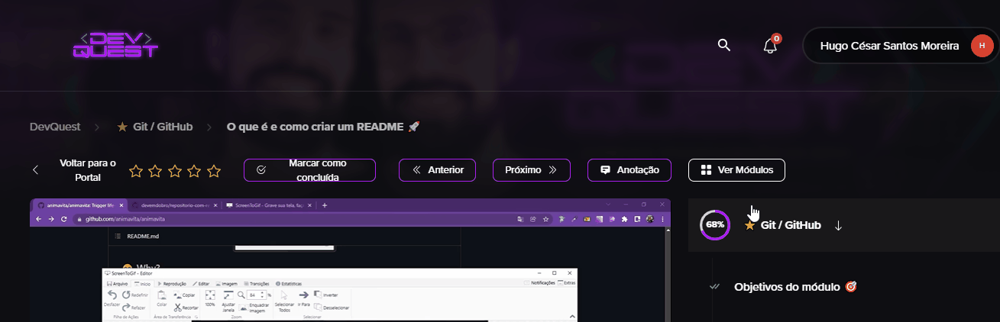

# Projeto com README
Um projeto de teste com um arquivo README 🚀

[](https://google.com)

## Tecnologias utilizadas
- HTML
- CSS
- JS

## Como utilizar 

Sessão importante para o momento em que aprendermos o uso de React e Typescript, por exemplo. Informar aqui comandos úteis para o usuário.

## Clone para o projeto
1 - Clone do projeto 
```
git clone <url>
```

2 - Acessar a pasta do projeto:
```
cd repositorio-com-readme
```